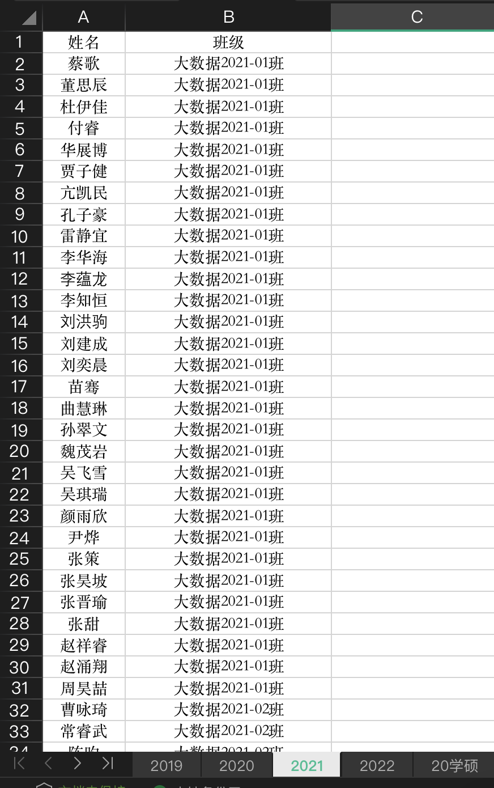

# 青年大学习学习率统计

## 简介

用于从excel中统计每个年级每个班青年大学习的完成数量

## 效果

| 原表格                                              | 统计后                                             |
| :--------------------------------------------------: | :--------------------------------------------------: |
|  |  |


## 使用

### 1. 导入package

项目目录中执行：
```commandline
pip3 install -r requirements.txt
```

### 2. 数据导入

在`raw.xlsx`中按照所给格式编辑

### 3. 运行

运行`main.py`，即可在当前目录生成一个`result.xlsx`文件，并自动将统计的结果导入
