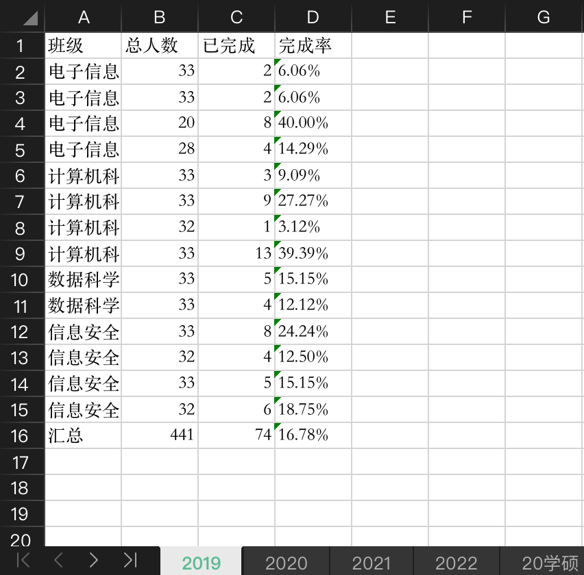

# 青年大学习学习率统计

## 简介

用于从excel中统计每个年级每个班青年大学习的完成率

## 效果

### 统计前

|                       每个班的总人数                        |                        未完成的人                         |
|:----------------------------------------------------:|:----------------------------------------------------:|
|  |  |

### 统计后

|                  生成的学习率表格                  |
| :------------------------------------------------: |
|  |


## 使用

### 1. 导入package

项目目录中执行：
```commandline
pip3 install -r requirements.txt
```

### 2. 数据导入

在`unfinished.xlsx`与`total.xlsx`中按照所给格式编辑

### 3. 运行

运行`main.py`，结果会自动保存到`result.xlsx`文件中（如果没有就会自动创建）
